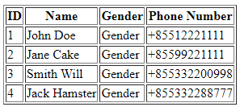
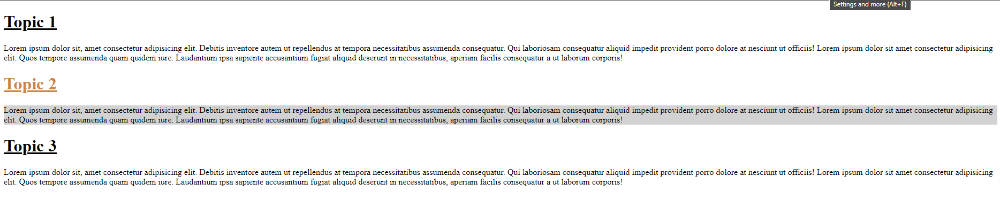
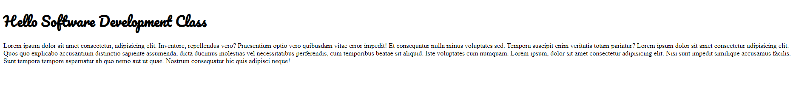
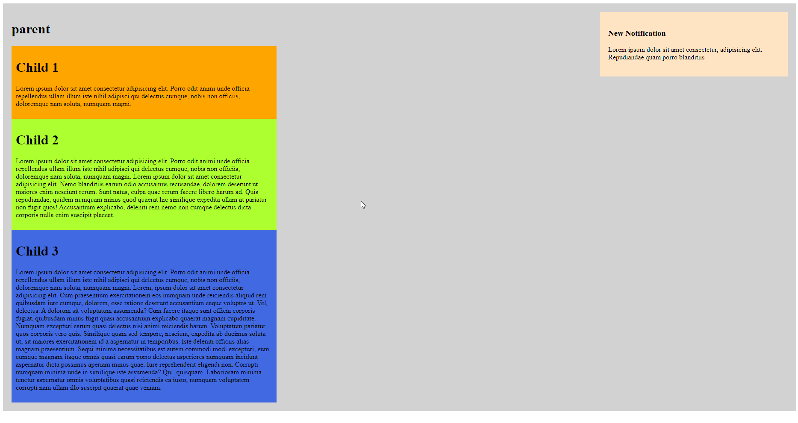
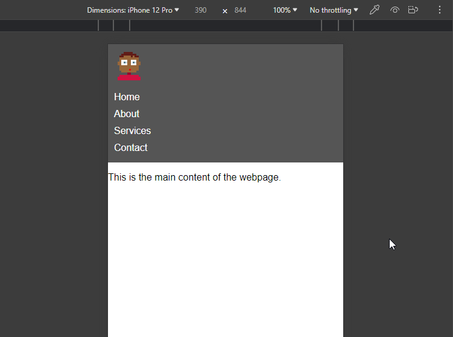
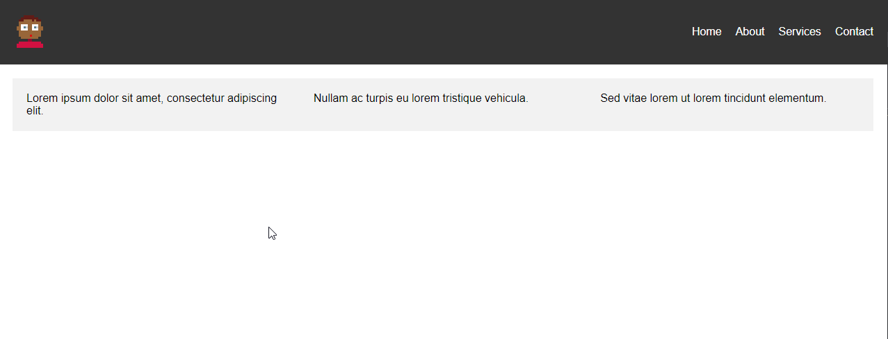
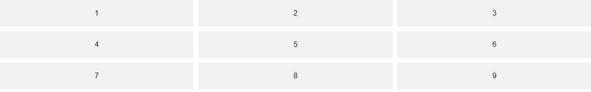

## HTML and CSS Skill Assessment Exercise

There are 8 questions in this exercise, each question will evaluated on different aspects of HTML and CSS.
The questions are as follows:

1. Create a simple HTML table with 4 columns and 4 rows. Follow the below structure for the table:
   

2. Format `Topic 2` and its paragraph with color and background color, please follow the below structure:
   
   Note: Do not change the HTML structure.

3. Update the header font to `Pacifico`, you file the custom font file in `fonts/Pacifico-Regular.ttf`. Please follow the below structure:
   
   Note: Do not change the HTML structure.

4. Style the notification box properly with the below structure:
   
   Note: Do not change the HTML structure.

5. Apply animated style to the text header as following:
   See the video instruction in `images/animation.mp4`

   Note: Do not change the HTML structure.

6. Display content to fit in screen of a mobile device (max 600px), please see the below structure:
   
   Note: Do not change the HTML structure.

7. Align acticle horizontally, with each article share the same width, height and they have space wrape at the start and ending position, please see the below structure:
   
   Note: Do not change the HTML structure.

8. Position item 1 to 9 properly using grid layout, please see the below structure:
   
   Note: Do not change the HTML structure.
